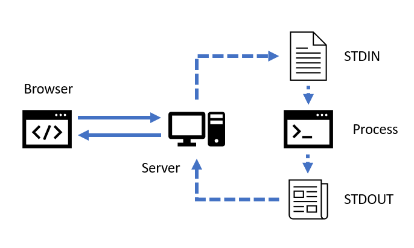
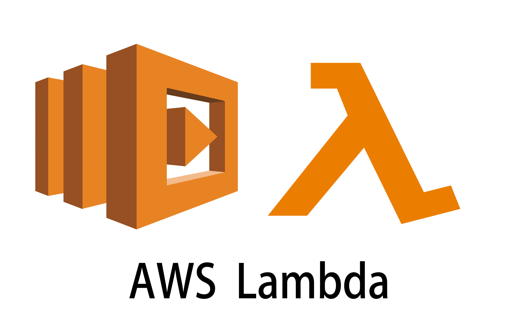

# 23: Esecuzione alternativa

---

## Ambienti


Abbiamo analizzato quattro diversi paradigmi, ovvero quattro diversi modi di organizzare il codice per ottenere diverse caratteristiche funzionali nella risoluzione di un problema.


La **concorrenza** ci permette di sfruttare meglio le risorse. La **distribuzione** ci permette di espanderci oltre il singolo nodo di calcolo. La **reattività** ci permette di minimizzare la latenza di risposta. Il **modello ad attori** ci permette di astrarre oltre l'asincronia e la distribuzione.

In tutti questi paradigmi, tuttavia, abbiamo sempre lavorato nel consueto ambiente di esecuzione di Java:

* il programma viene tradotto in bytecode ed eseguito dalla JVM;
* la JVM applica le strategie legate alla modalità JIT per bilanciare l'efficienza di esecuzione.

Questo però ha un costo in termini di tempo di avvio del programma: la JVM può aver bisogno di tempo (secondi) prima di avere a disposizione dati sufficienti per effettuare le scelte relative a quale codice trasformare con JIT. Inoltre, il codice iniziale è necessariamente interpretato, e quindi più lento. E anche la JIT ha il suo costo in termini di prestazioni.

Quando Java e la JVM sono stati inventati, questa scelta era vantaggiosa: la performance a regime, raggiungeva livelli da accettabili a ottimi, e il codice era facilmente portabile (Write Once Run Aniwhere).

Negli ultimi 25 anni le cose sono cambiate: il numero di OS si è ridotto, il modo di usare i server è cambiato, la durata media di un programma su un server è cambiata.

---

## Server(less)


I primi siti web "dinamici" funzionavano nel modo seguente:



La richiesta del browser al server diventava lo standard input per un normale programma POSIX (che non sapeva che stava servendo una richiesta in remoto), che veniva eseguito; lo standard output del programma diveniva quindi la risposta inviata al browser. La richiesta da parte di un browser era simile all'invocazione di un comando locale.

Questa modalità di funzionamento venne formalizzata nello standard  _Common Gateway Interface_ (CGI). È ancora possibile configurare un server web in questo modo. Per realizzare i programmi erano molto usati linguaggi di scripting, per es. Perl, Python ma anche direttamente shell. Con tutto quello che ne consegue. PHP nasce in questo modo.

Molto presto diventa evidente la penalità di performance dovuta all'avvio di un processo per ogni richiesta di un browser. Nasce l'application server, per mantenere sempre pronte alla risposta le applicazioni. L'application server non avvia un processo separato, ma un thread. (es. Web Service Apache, server Python e Perl)

L'application server è spesso legato ad una precisa tecnologia o linguaggio di programmazione. Inoltre, le problematiche di compatibilità fra OS UNIX-like e Windows sono un fattore limitante nella scelta di un server, in quanto determinano una scelta di campo.


Java e la JVM quindi nascono in una situazione in cui è normale per un server rimanere in esecuzione, in attesa di richieste.

In questo paradigma l'efficienza si persegue gestendo più applicazioni sulla stessa macchina, che ne condividono le risorse. Questo perché scalare in orizzontale era molto difficile, si preferiva usare una macchina molto potente.

Dopo vent'anni però la situazione cambia:

<!-- .element: style="width: 55%"-->

Si è più svincolati dal livello fisico e si può scalare orizzontalmente, e non si usano più delle risorse necessarie.

Oggi, un servizio cloud cosiddetto _serverless_ (cosiddetto perché il server esiste comunque, ma non è una singola macchina imponente) permette di acquisire le risorse necessarie all'esecuzione di una sola richiesta, pagando unicamente i millisecondi usati per costruire la risposta.

Non  si ha più un server in attesa delle richeste: o meglio, non lo abbiamo noi, ce l'ha il fornitore di servizi server (AWS etc.). Per noi il server viene avviato a richiesta ed esiste per il tempo strettamente necessario ad erogare una sola risposta.

Il tempo di startup e la dimensione di un application server, modalità tipiche di erogazione di molti tipi di applicazioni, diventano uno svantaggio. Pertanto Java non è la prima scelta per applicazioni serverless, per il tempo di startup della JVM. Sebbene le prestazioni a regime siano di ottimo livello, lo diventano solo dopo diversi secondi di attività, quindi Java viene usato solo per elaborazioni più complesse.

La strategia della JIT (Just In Time) si trova in direzione opposta rispetto a questa situazione tecnologica, che copre una fetta di mercato rilevante. 

Il seguente framework rende Java più competitivo in questo nuovo contesto, nel quale le prime scelte sono Python e node.js

---

## GraalVM


Il progetto [GraalVM](https://www.graalvm.org/) nasce come progetto di riscrittura del compilatore Java in Java stesso, per poi focalizzarsi sulla sola parte di frontend del compilatore.

 <!-- .element: style="width: 55%"-->


In seguito a questo cambio di rotta, diventa un sistema completo (incluso nella JDK) che include:
* un nuovo compilatore JIT;
* un compilatore ahead-of-time (classico) per Java;
* una specifica di codice intermedio ("Truffle Language Implementation framework");
* un back-end che usa il sistema LLVM ed un runtime minimale per ottenere un eseguibile nativo da una rappresentazione Truffle;
* strumentazione agnostica rispetto al linguaggio per il debug e l'ottimizzazione.

Il compilatore JIT può sostituire quello ufficiale di Java. Il compilatore AOT produce una rappresentazione in "Truffle" che puoi poi passare agli stadi successivi.


GraalVM è in grado di compilare un qualsiasi bytecode da un linguaggio sulla JVM in un **eseguibile nativo** (non bytecode). Attraverso Truffle può supportare anche altri linguaggi. Esistono già front-end per Ruby, JavaScript (con supporto per Node), Python, Webassembly.

La compilazione ahead-of-time, in un linguaggio dinamico come Java, ha sicuramente i suoi problemi: in particolare il sistema di Classloading e le feature di _reflection_ (funzionalità per cui è possibile scrivere codice di un linguaggio atto ad analizzare codice dello stesso linguaggio) devono essere limitate per rendere prevedibile il codice disponibile al runtime. (La reflection è un insieme di API che permette, durante l'esecuzione, di ispezionare la struttura della classi.)

Diverse librerie e strumenti anche popolari richiedono un adattamento particolare per funzionare con GraalVM. L'interesse spinto dal mercato è tale che è stato fatto molto lavoro in questo senso.

Quello che si ottiene è una sostenuta riduzione della dimensione dell'eseguibile finale , ma sopratutto del tempo di avvio.

Tuttavia la performance di regime potrebbe essere leggermente peggiore, non avendo a disposizione le informazioni di runtime che invece il sistema JIT può raccogliere e usare. Dunque viene utilizzata per situazioni in cui è richiesto tempo di avvio breve e raramente il sistema arriva a regime

---

## Java to Container

Il passo successivo è avere un framework che a partire dal programma Java generi non solo l'eseguibile ma anche un eseguibile su un'infrastruttura Docker, perché questo è lo standard a cui ci si sta adeguando (è molto probabile che il fornitore di servizi serverless richieda un'immagine per container Docker, in modo che il sistema possa decidere quante istanze avviarne, quando avvierne e spegnerle e se tenerne attive una o più)

Attraverso un framework che supporta GraalVM possiamo adattare un precedente esempio per osservare come ottenerne un eseguibile nativo già impacchettato in un container, ovvero un immagine Docker che contiene un piccolo strato di Sistema Operativo e il nostro codice che è diventato _codice nativo_, dunque non contiene il JDK ma solo la parte di JDK che interessa.

Molti framework offrono supporto per GraalVM tra cui VertX, [Quarkus](https://quarkus.io/), [Helidon](https://helidon.io/#/).
Scegliamo per questo esempio il framework [Micronaut](https://micronaut.io).

<!-- .element: style="width: 55%"-->

Micronaut è un framework molto diverso da VertX: è particolarmente _opinionated_ e propone una impostazione precisa di progetto, scegliendo all'interno dell'insieme delle tecnologie supportate le implementazioni delle funzioni.


Questo approccio è dettato dalla necessità di selezionare ed integrare specificamente quei componenti che sono utilizzabili con GraalVM e compatibili con il processo di compilazione ahead-of-time.


Questo approccio è particolarmente evidente nel modo consigliato di preparazione di un progetto: [un'apposita area del sito permette](https://micronaut.io/launch/) di selezionare le tecnologie di cui si ha bisogno (tipo di app, versione di Java, base package, versione di Micronaut, linguaggio, tecnologia di build e di test) e genera un progetto d'esempio configurato con quelle tecnologie.  Invece VertX a seguito dell'inserimento di una funzione indica quali dipendenze sono necessarie da inserire per una data funzione.

Al repository  
https://hg.sr.ht/~michelemauro/app2020-mnaut  
trovate il progetto d'esempio che andiamo ad analizzare.

La creazione di una immagine Docker può richiedere diversi minuti.


Gran parte del progetto è analoga all'esempio TicTacToe che abbiamo già visto nelle precedenti lezioni. Il codice di dominio è praticamente identico, a meno di riposizionamento del package. La parte che ha subito più modifiche è l'interfacciamento con il framework, in particolare la dichiarazione delle rotte.

Micronaut ha in questo un approccio molto differente da VertX; in modo decisamente più tradizionale, usa delle [annotazioni](https://www.javaquery.com/2015/10/understanding-annotations-in-java.html), che sono una forma di metadati, inseribile in codice sorgente. Le annotazioni sono presenti da Java 5, e sono diverse da Javadoc.

Le annotazioni sono note al momento della compilazione. Esiste già un supporto nel compilatore per analizzarle come passaggio di compilazione per produrre metadati che possono essere usati dai passi successivi, ad esempio per sapere quali parti del JDK sono necessarie.


Il server si può avviare con `./gradlew run` per lanciarlo in modalità normale, eseguito sulla JVM. Lanciando `./gradlew dockerBuildNative` si avvia la costruzione dell'immagine docker. Lo startup del server TicTacToe (compilazione in modalità normale) ha impiegato a lezione circa 3600 secondi (tanti per un servizio serverless).


```java
@Controller("/")
public class Server {

  private static final String GAME_NOT_FOUND = ...
  private static final String JOIN_FORM = ...
  private static final String WAIT_FOR_ANOTHER = ...

  static final ObjectMapper mapper = new ObjectMapper();
```

La classe server è annotata con `@Controller` per indicare al sistema che contiene metodi che devono essere mappati su servizi esposti al pubblico. Le costanti sono le stesse dell'altro esempio. 

Jackson, sebbene sia una libreria che fa ampio uso della reflection, è qui stato adattato alla compilazione ahead-of-time e quindi può essere tranquillamente usato.


Tutte le classi annotate con `@Controller` vengono raccolte all'avvio del server e la struttura delle API esposte viene costruita analizzando il loro contenuto.

Questo lavoro viene fatto:

* a _run-time_ se il framework viene avviato come applicazione sulla JVM;
* a _compile-time_ se viene generato un eseguibile nativo.

Dunque la generazione di codice nativo permette di risparmiare lavoro a run-time!


```java
@Get(value = "/", produces = MediaType.TEXT_HTML)
public String welcome() {
  return JOIN_FORM;
}
```

Le annotazioni indicano i metodi che devono servire le varie richieste, specificando

* il pattern di URL a cui rispondono;

* i formati trattati;

* l'interfacciamento con la richiesta.


A differenza di VertX non specifichiamo questi tre parametri con chiamate successive, ma gli esponiamo come metadati aggiunti nel nostro codice. La conseguenza è che noi possiamo chiamare il nostro codice anche fuori dal framework web, perché i metadati sono trattati solo se eseguiamo il nostro codice all'interno del framework. 

In casi più complessi si possono aggiungere altri automatismi: nell'esempio seguente l'annotazione `@get` contiene un pattern. Viene annotato anche uno degli argomenti del metodo (`@PathVariable String playerId`).

Il pattern può contenere variabili, che possono essere trasformate direttamente in parametri del metodo. L'annotazione ha accesso al nome lessicale del parametro, e quindi può riconoscerlo dentro il pattern. Quindi è in grado di predisporre i dati che dicono al framework di attendere la richiesta, prendere la parte `"/game/{playerId}"` dell'URL, trasformarla in `String playerId` e chiamare il metodo `gameStatus`.


```java
@Get(value = "/game/{playerId}", 
  produces = MediaType.TEXT_HTML)
public HttpResponse< String > gameStatus(
  @PathVariable String playerId) {
  
  boolean open = gameServer.open(playerId);
  if (!open) 
    return HttpResponse.notFound().body(GAME_NOT_FOUND);

  String result = gameServer.status(playerId)
    .map((res) -> render(playerId, res.idx, res.status))
    .orElse(String.format(WAIT_FOR_ANOTHER, playerId));
  return HttpResponse.ok().body(result);
}
```


La chiamata del metodo non ha nulla di particolare se non che il percorso fra l'arrivo della richiesta e la chiamata del metodo contiene trasformazioni che il framework fa sfruttando la conoscenza (disponibile a compile-time) di metadati.

La risposta è costruita a partire dal valore di ritorno del metodo; se complessa (es. contiene uno stato HTTP, degli header etc.) deve essere contenuta in un oggetto adeguatamente espressivo ( `HttpResponse` nell'esempio di sopra). 

I parametri vengono convertiti secondo una serie di convenzioni. È possibile fornire al framework delle strategie specifiche per personalizzare la conversione.


```java
@Post(
  value = "/game{/playerId}",
  produces = MediaType.TEXT_HTML,
  consumes = MediaType.APPLICATION_FORM_URLENCODED)
public HttpResponse< String > game(
  @PathVariable @Nullable String playerId, 
  @Nullable Integer move) {

  if (playerId == null) {
    GameLocation location = ...;
    return HttpResponse.status(HttpStatus.TEMPORARY_REDIRECT)
      .header("Location", location.game)
      .body("");
  }
```


In questo caso la situazione è più complessa: il linguaggio del pattern non può esprimere la facoltatività di una parte dell'URL (con o senza il parametro `playerId`).

Dunque abbiamo annotato il parametro `playerId` come `@Nullable`, ovvero potenzialmente nullo.

La scelta del framework è quella di usare `null` come valore mancante, piuttosto che un più espressivo `Optional`. Siamo "costretti" ad indicare i parametri annullabili, in conformità con la configurazione del pattern della URL.


Nel caso in cui il parametro `playerId` manchi, stiamo rispondendo ad una richiesta `POST /game`.

Se invece è presente, stiamo rispondendo ad una richiesta `POST /game/123456`.


```java
  boolean open = gameServer.open(playerId);
  if (!open) return HttpResponse.notFound()
    .body(GAME_NOT_FOUND);

  String result = ...
  return HttpResponse.ok().body(result);
}
```
Il resto del metodo è molto simile a VertX, ma è un metodo non una lambda e risponde in maniera differente: non chiama metodi per mutare il contesto construisce un metodo `HttpResponse` e lo restituisce.

Allo stesso modo per l'API che risponde in formato JSON.


```java
@Post(value = "/game{/playerId}", 
  produces = MediaType.APPLICATION_JSON)
public HttpResponse< String > gameApi(
  @PathVariable @Nullable String playerId, 
  @Nullable Integer move) {

  if (playerId == null) {
    GameLocation location = ...;
    return HttpResponse.ok()
      .body(location.toJson(mapper));
  }
```


```java
  boolean open = gameServer.open(playerId);
  if (!open) return HttpResponse.notFound()
    .body(GAME_NOT_FOUND);
  String result = gameServer.status(playerId)...
  return HttpResponse.ok().body(result);
}
```


Una volta completata la costruzione dell'immagine docker, questa può essere avviata con:

```
docker run --rm -p8080:8080 tictactoe:latest
```
La costruzione impiega circa 10 minuti e vengono mostrati a console i passi di compilazione statica GraalVM. Il risultato è un'immagine di circa 80 MB, meno della metà del JDK.
L'avvio avviene in circa 70 ms (rispetto ai 3600ms del codice eseguito tradizionalmente!).

---

## Altri Runtime


Esistono altri approcci per perseguire obiettivi simili a quelli di GraalVM, seguendo però strade differenti.

[TornadoVM](https://www.tornadovm.org/) è un plugin per varie implementazioni di JVM che permette di scrivere codice Java in grado di essere eseguito su GPU, FPGA ed altri hardware eterogenei, accedendo a paradigmi di calcolo di solito dominio esclusivo di linguaggi di basso livello o molto specializzati (rednering intesnivo, training di reti neurali ecc.).


[KotlinNative](https://kotlinlang.org/docs/reference/native-overview.html) si appoggia ad LLVM per produrre un eseguibile direttamente dal codice Kotlin senza passare per la JVM.

La struttura del linguaggio e del suo compilatore permettono questo passaggio. Il risultato è un eseguibile nativo, compilato ahead-of-time time con un approccio diverso da GraalVM, adattato per un contesto serverless (con tempo di avvio molto breve).
